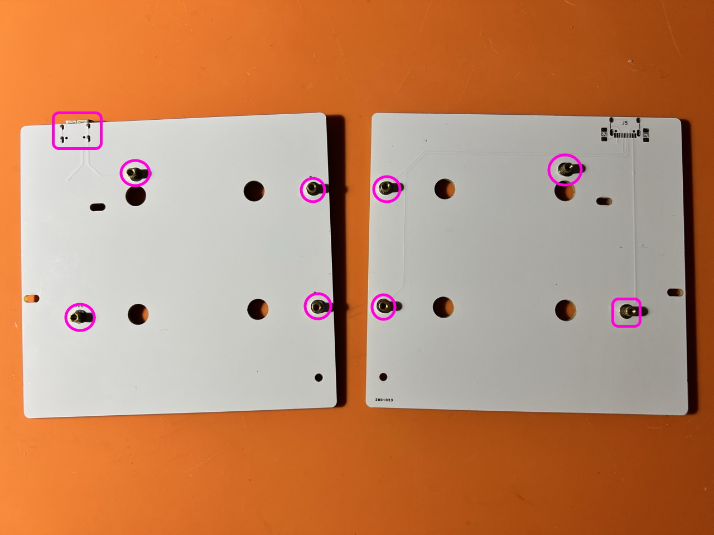
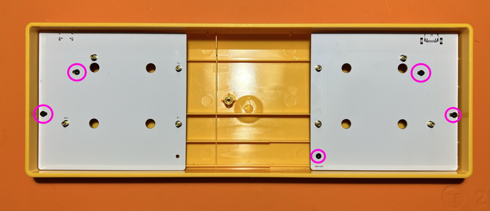

# 60%ケース対応パーツ ビルドガイド

## キット内容
  
||部品名|数|
|-|-|-|
|1|60%ケース用トッププレート|1|
|2|マウントプレート|2|
|3|ネジ|16|
|4|スペーサー|8|

### メインボードをケースに設置する
マウントプレートにスペーサー、ワッシャー、ナットを取り付けます。  
Type-Cのコネクタが付いている方を左側にして、画像のように付けてください。  
   
ワッシャーはスペーサーの側に通します。  
   
ケースにマウントプレートをねじ止めします。  
   
メインボードをねじ止めします。  
   

### トッププレートを取り付ける
メインボードとトッププレートの位置を合わせて、まずは4隅にキースイッチをはめ込みます。  
   
メインプレートにはスイッチのツメにひっかかるように、メインボードに差す時はピンが曲がらないように気を付けます。  
   
キーキャップを付けたら完成です。
 
LEDをオフにしたい場合は左上(ESC)のキーを押しながらその下のキーを押してください。
