# On the 15 ビルドガイド（[English](README_EN.md)）
- [キット内容](#キット内容)
- [レイアウトを決める](#レイアウトを決める)
- [はんだ付け](#はんだ付け)
- [組み立て](#組み立て)
- [キーマップのカスタマイズ](#キーマップのカスタマイズ)
- [そのほか](#そのほか)

## キット内容
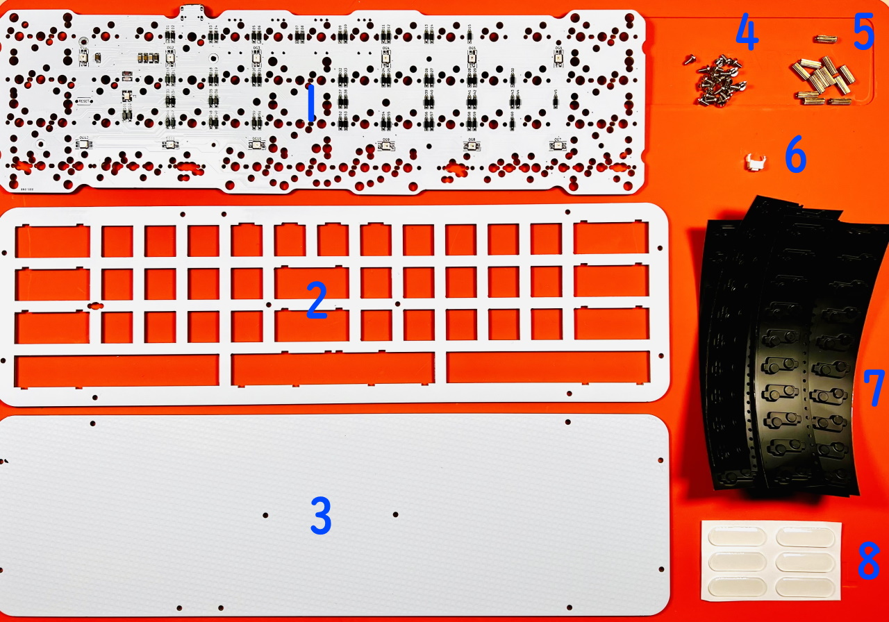  
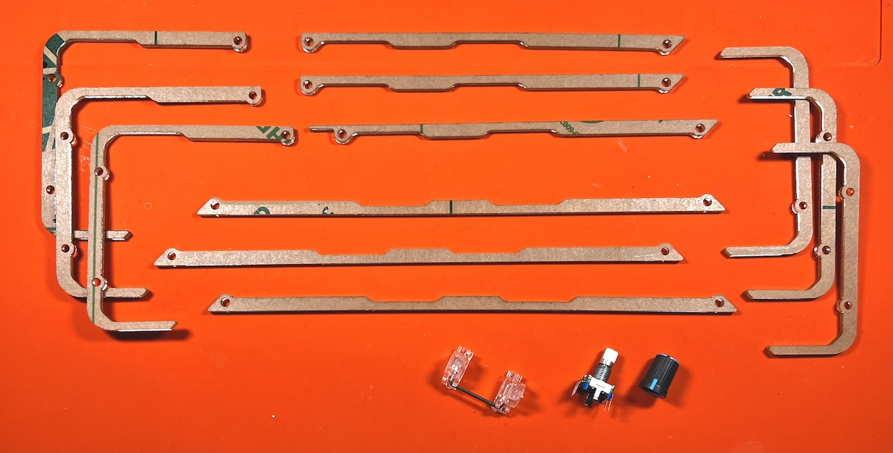  
||部品名|数| |
|-|-|-|-|
|1|メインボード|1||
|2|トッププレート|1||
|3|ボトムプレート|1||
|4|ネジ|22||
|5|スペーサー|11||
|6|リセットスイッチ|1||
|7|Cherry MX ホットスワップソケット|60||
|8|ゴム足|6||
|9|アクリルミドルプレート|||
|10|2Uスタビライザー|1|色は決まっていません|
|11|ロータリーエンコーダー|1|EC11互換品|
|12|ノブ|1|色は決まっていません|

### キット以外に必要なもの
|部品名|数|||
|-|-|-|-|
|キースイッチ|〜60|CherryMX互換|[遊舎工房](https://shop.yushakobo.jp/collections/all-switches/cherry-mx-%E4%BA%92%E6%8F%9B-%E3%82%B9%E3%82%A4%E3%83%83%E3%83%81) / [TALPKEYBOARD](https://talpkeyboard.net/?category_id=59cf8860ed05e668db003f5d) / [DailyCraftKeyboard](https://shop.dailycraft.jp/collections/mx-switches)|
|キーキャップ|〜60|CherryMX互換|[遊舎工房](https://shop.yushakobo.jp/collections/keycaps/cherry-mx-%E4%BA%92%E6%8F%9B-%E3%82%AD%E3%83%BC%E3%82%AD%E3%83%A3%E3%83%83%E3%83%97) / [TALPKEYBOARD](https://talpkeyboard.net/?category_id=59e2acfaed05e644fd004008)|
|Type-C ケーブル|1|||

### 追加できるもの
|部品名|||
|-|-|-|
|色違いアクリルプレート|-|[遊舎工房 - キーボードアクリルプレート](https://shop.yushakobo.jp/collections/services/products/keyboard_acrylic_plate?variant=43949129629927)|
|スタビライザー|2U、PCBマウント|[遊舎工房](https://shop.yushakobo.jp/collections/all-keyboard-parts/Stabilizer) / [TALPKEYBOARD](https://talpkeyboard.net/?category_id=5f884b9b3313d216eb50558a)|
|ロータリーエンコーダ|EC11/EC12/ロープロファイル|[遊舎工房](https://shop.yushakobo.jp/search?q=%E3%83%AD%E3%83%BC%E3%82%BF%E3%83%AA%E3%83%BC%E3%82%A8%E3%83%B3%E3%82%B3%E3%83%BC%E3%83%80%E3%83%BC+%E3%83%8E%E3%83%96%E4%BB%98%E3%81%8D) / [TALPKEYBOARD](https://talpkeyboard.net/items/5f3f1a597df28129f2fd4b0f) / [DailyCraftKeyboard](https://shop.dailycraft.jp/products/encoder_low)|
|ノブ|外径19mmまで|[遊舎工房](https://shop.yushakobo.jp/products/3733) / [DailyCraftKeyboard](https://shop.dailycraft.jp/products/encoder_lowprofile_knob)|

### 必要な工具
|工具名|
|-|
|はんだごて|
|こて先クリーナー（こて台）|
|鉛入りはんだ|
|ピンセット|
|精密ドライバー|

## レイアウトを決める
On the 15は60キーの格子配列キーボードですが、色のついたキーは長さを変更することができます。  
  

RemapやKeyboard Layout Editorでシミュレーションすることもできます。  
- [Remap - On the 15 - KEYMAP](https://remap-keys.app/catalog/9bQPDxdkX8xgflHlsR9p/keymap)
- [Keyboard Layout Editor](http://www.keyboard-layout-editor.com/#/gists/feebeb1f95b04ed5593eb9c8289f1239)

ビルドガイドではこのようなレイアウトで組み立てます。　
  

## はんだ付け
### ソケットのはんだ付け
使うソケットのパッドに予備はんだをします。  
あらかじめ薄くはんだを乗せます。  
  
ソケットを置いたらピンセットで押さえつけながらはんだを注いでいきます。入り組んでいて表面積が多いので多めに必要になります。
  
最下段のキーはシルク印刷を参考にしてソケットを取り付けてください。
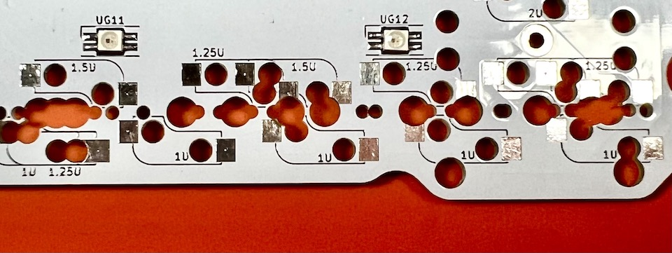  
慣れてきたら予備はんだを省略したり、一度に複数個置いてはんだ付けをすると楽になります。  
  
### リセットスイッチのはんだ付け
表面左側のRESETと書いてあるところにリセットスイッチを差して裏からはんだ付けします。  
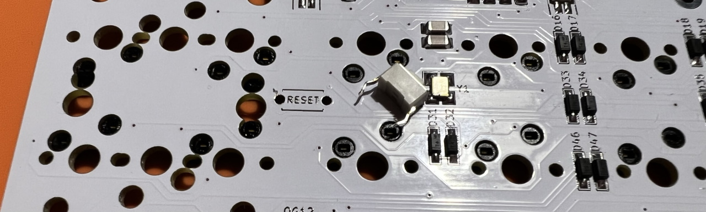  

### ロータリーエンコーダーのはんだ付け
足を折らないようにホールに通して裏からはんだ付けします。  
   

### 動作確認
キースイッチを差したり裏をピンセットで短絡したりして動作確認をしておくと安心です。  
   
   

## 組み立て
### スタビライザーを組み立てる
スタビライザーがあると2Uのキーの押下が安定します。無くても使えるのでお好みでお使いください。  
ねじ止め式のスタビライザーは縦に二つ並べておくことはできないので使う場所に気をつけるかスナップ型のスタビライザーを使ってください。  

小さい方のパーツの穴が二つ開いている側を、大きいパーツの穴が開いている方向に合わせて組み合わせます。  
  
金属の棒を下の穴に差し込みツメにパチっと音がするまで押し込んで完成です。  
    
基板の大きい方の穴にツメをひっかけながら取り付けます。  
  

### メインボードにトッププレートを取り付ける
トッププレートの裏側にスペーサーをねじ止めします。  
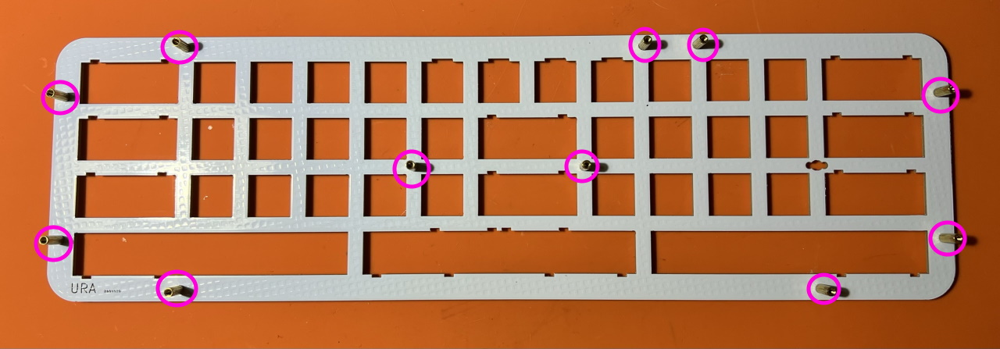   
メインボードにかぶせて、4隅のスイッチをはめ込みます。  
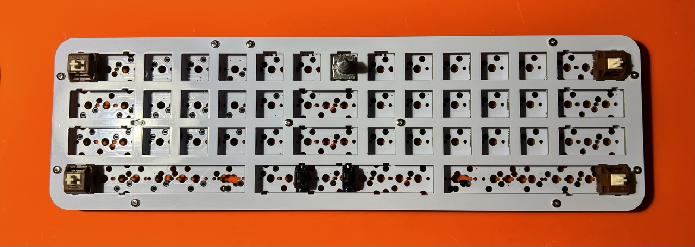   
すべてのスイッチを差し込みました。  
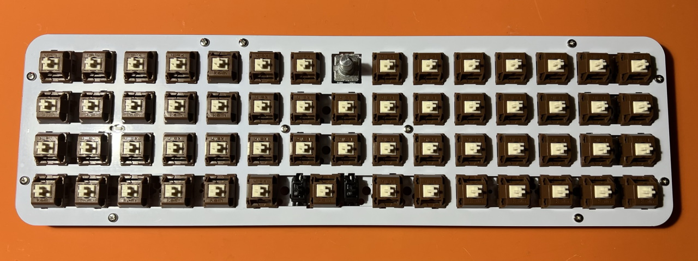  

### アクリルプレートを挟み込む
画像のような形で3段にして挟み込みます。  
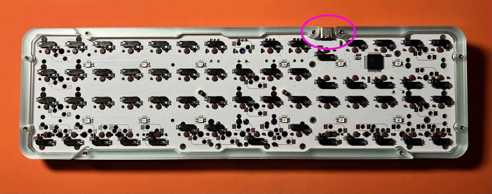  
赤丸の部分の1段目は一度スペーサーを外してスライドさせてください。
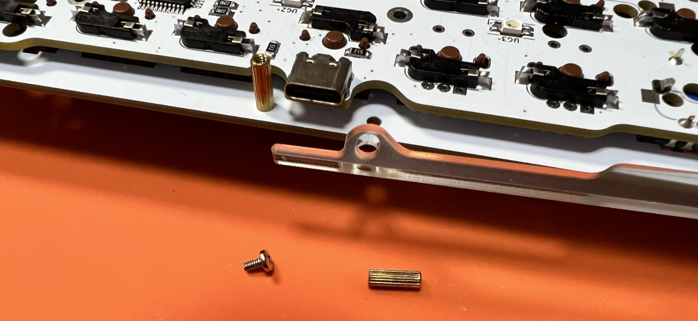  

### バックプレートを取り付ける
バックプレートをねじ止めしてゴム足を貼ります。  
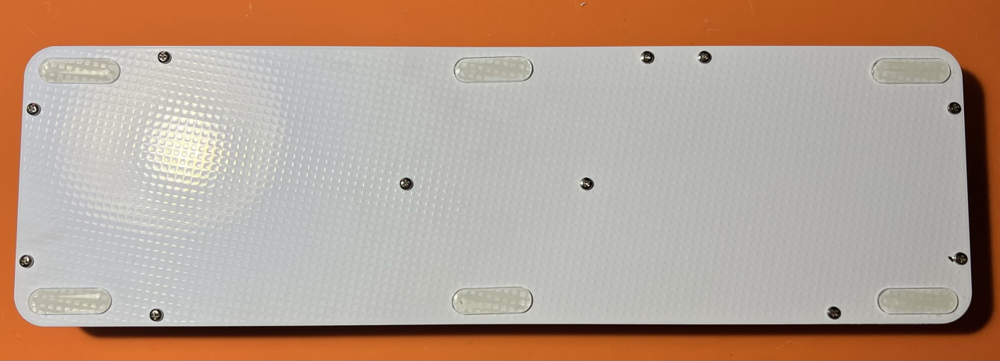  
キーキャップを付けたら完成です。  
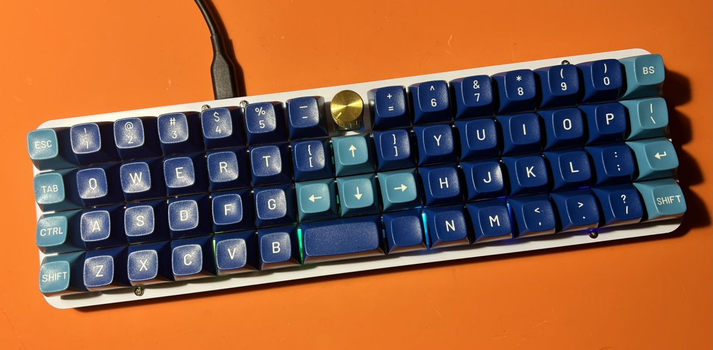  
LEDをオン/オフにしたい場合は左上(ESC)のキーを押しながらその下のキー（Tab）を押してください。   
光り方を変えたい場合は左上(ESC)のキーを押しながらその隣のキー（1か2）を押してください。  
これらは設定で変更することが可能です。  

## キーマップのカスタマイズ
デフォルトではビルドガイドに合わせたキーマップになっています。

ChromeかEdgeでRemapにアクセスしてください。  
- Remap https://remap-keys.app/

  
左を選んで進んでいくとアドレスバーからメッセージが出てキーボードを選択できます。  

ドラッグアンドドロップでキーマップの変更が終わったら右上のflashボタンを押すと反映されます。  
  

### レイアウトオプション
キーの長さを作ったキーボードと合わせることができます。
  
### レイアウトの保存と復元
⇔アイコンで作ったレイアウトを保存することができます。  
  
いくつかサンプルをご用意しました。自分のレイアウトを公開することもできますのでお気軽に共有してください。

## そのほか
### リセットスイッチの押し方
こちらの隙間からドライバーやピンセットを差し込むことで押すことができます。
  
### 60%ケースに入れる
60%ケース対応パーツをご購入いただくことでPoker互換ケースに入れることができます。
- [60%ケース対応パーツ ビルドガイド](60.md)

### ファームウェアのコード
https://github.com/Taro-Hayashi/qmk_firmware/tree/tarohayashi/keyboards/tarohayashi/onthe15

### VIA用JSON
- [onthe15.json](https://github.com/Taro-Hayashi/On-the-15/releases/download/15.23/onthe15.json)

### プレートのデータ
- [onthe15_plates.zip](https://github.com/Taro-Hayashi/On-the-15/releases/download/15.23/onthe15_plates.zip)

### 販売ページ
- 遊舎工房: [On the 15](https://shop.yushakobo.jp/products/4994?variant=43917315539175)
- BOOTH: [On the 15（B-Stock）、60%ケース対応パーツ](https://tarohayashi.booth.pm/items/3672079)

