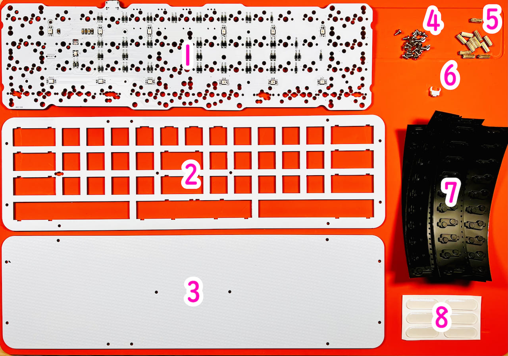
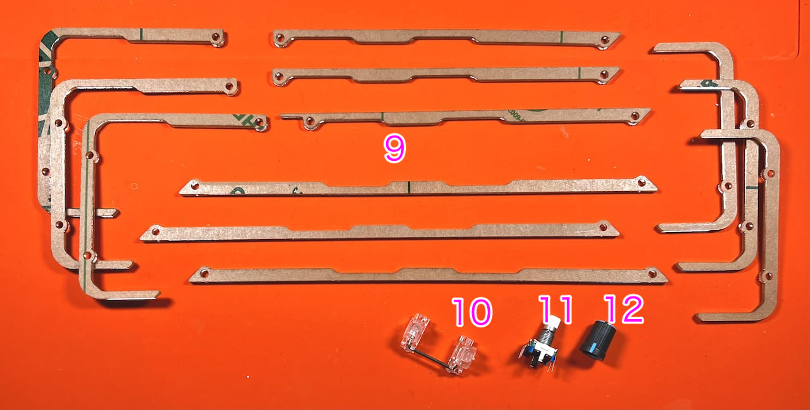
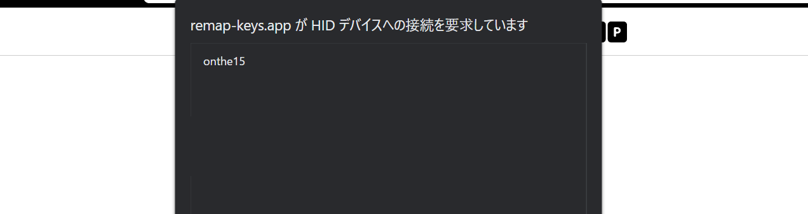

# On the 15 ビルドガイド（[English](README_EN.md)）
- [キット内容](#キット内容)
- [レイアウトを決める](#レイアウトを決める)
- [はんだ付け](#はんだ付け)
- [組み立て](#組み立て)
- [キーマップのカスタマイズ](#キーマップのカスタマイズ)
- [そのほか](#そのほか)

## キット内容
  
  
||部品名|数|
|-|-|-|
|1|メインボード|1|
|2|トッププレート|1|
|3|ボトムプレート|1|
|4|ネジ|22|
|5|スペーサー|11|
|6|リセットスイッチ|1|
|7|Cherry MX ホットスワップソケット|60|
|8|ゴム足|6|
|9|アクリルミドルプレート||
|10|2Uスタビライザー|1|
|11|ロータリーエンコーダー|1|
|12|ノブ|1|

### キット以外に必要なもの
|部品名|数|||
|-|-|-|-|
|キースイッチ|〜60|CherryMX互換|[遊舎工房](https://shop.yushakobo.jp/collections/all-switches/cherry-mx-%E4%BA%92%E6%8F%9B-%E3%82%B9%E3%82%A4%E3%83%83%E3%83%81) / [TALPKEYBOARD](https://talpkeyboard.net/?category_id=59cf8860ed05e668db003f5d) / [DailyCraftKeyboard](https://shop.dailycraft.jp/collections/mx-switches)|
|キーキャップ|〜60|CherryMX互換|[遊舎工房](https://shop.yushakobo.jp/collections/keycaps/cherry-mx-%E4%BA%92%E6%8F%9B-%E3%82%AD%E3%83%BC%E3%82%AD%E3%83%A3%E3%83%83%E3%83%97) / [TALPKEYBOARD](https://talpkeyboard.net/?category_id=59e2acfaed05e644fd004008)|
|Type-C ケーブル|1|||

### 追加できるもの
|部品名|||
|-|-|-|
|色違いアクリルプレート|-|[遊舎工房 - キーボードアクリルプレート](https://shop.yushakobo.jp/collections/services/products/keyboard_acrylic_plate?variant=43949129629927)|
|スタビライザー|2U、PCBマウント|[遊舎工房](https://shop.yushakobo.jp/collections/all-keyboard-parts/Stabilizer) / [TALPKEYBOARD](https://talpkeyboard.net/?category_id=5f884b9b3313d216eb50558a)|
|ロータリーエンコーダ|EC11/EC12/ロープロファイル|[遊舎工房](https://shop.yushakobo.jp/search?q=%E3%83%AD%E3%83%BC%E3%82%BF%E3%83%AA%E3%83%BC%E3%82%A8%E3%83%B3%E3%82%B3%E3%83%BC%E3%83%80%E3%83%BC+%E3%83%8E%E3%83%96%E4%BB%98%E3%81%8D) / [TALPKEYBOARD](https://talpkeyboard.net/items/5f3f1a597df28129f2fd4b0f) / [DailyCraftKeyboard](https://shop.dailycraft.jp/products/encoder_low)|
|ノブ|外径19mmまで|[遊舎工房](https://shop.yushakobo.jp/products/3733) / [DailyCraftKeyboard](https://shop.dailycraft.jp/products/encoder_lowprofile_knob)|

専用のアクリルケースもあります。  
- [On the 15 アクリル積層ガスケットマウントケース](https://github.com/Taro-Hayashi/On-the-15-AcrylicCase/blob/main/README.md)  

### 必要な工具
|工具名|
|-|
|はんだごて|
|こて先クリーナー（こて台）|
|鉛入りはんだ|
|ピンセット|
|精密ドライバー|

## レイアウトを決める
On the 15は60キーの格子配列キーボードですが、色のついたキーは長さを変更することができます。  
  

ビルドガイドではこのようなレイアウトで組み立てます。　
  

## はんだ付け
### ソケットのはんだ付け
使うソケットのパッドに予備はんだをします。  
あらかじめ薄くはんだを乗せます。  
  
ソケットを置いたらピンセットで押さえつけながらはんだを注いでいきます。入り組んでいて表面積が多いので多めに必要になります。

慣れてきたら予備はんだを省略したり、一度に複数個置いてはんだ付けをすると楽になります。  
  
### リセットスイッチのはんだ付け
表面左側のRESETと書いてあるところにリセットスイッチを差して裏からはんだ付けします。  
  

### ロータリーエンコーダーのはんだ付け
足を折らないようにホールに通して裏からはんだ付けします。  
   

### テストファームウェアの書き込み
テスト用のファームウェアをこちらからダウンロードしてください。
- https://remap-keys.app/catalog/9bQPDxdkX8xgflHlsR9p/firmware

 

QMK Toolboxのreleaseページから最新版をダウンロードしてインストールください。  
- [Releases・qmk/qmk_toolbox](https://github.com/qmk/qmk_toolbox/releases)

  
起動したらOpenを押してダウンロードしたファームウェアを指定し、はんだ付けしたリセットボタンを押します。  
   
新しく黄色の文字が出てきたらFlashを押します。  
  

Thank youの後に黄色い文字が出たら更新完了です。  
   

### 動作確認
キースイッチを差したり裏をピンセットで短絡したりして動作確認をします。  
   
   

## 組み立て
### スタビライザーを組み立てる
スタビライザーがあると2Uのキーの押下が安定します。無くても使えるのでお好みでお使いください。  
ねじ止め式のスタビライザーは縦に二つ並べておくことはできないので使う場所に気をつけるかスナップ型のスタビライザーを使ってください。  

小さい方のパーツの穴が二つ開いている側を、大きいパーツの穴が開いている方向に合わせて組み合わせます。  
  
金属の棒を下の穴に差し込みツメにパチっと音がするまで押し込んで完成です。  
    
基板の大きい方の穴にツメをひっかけながら取り付けます。  
  

### メインボードにトッププレートを取り付ける
トッププレートの裏側にスペーサーをねじ止めします。  
   
メインボードにかぶせて、4隅のスイッチをはめ込みます。  
   
すべてのスイッチを差し込みました。  
  

### アクリルプレートを挟み込む
画像のような形で3段にして挟み込みます。  
  

### バックプレートを取り付ける
バックプレートをねじ止めしてゴム足を貼ります。  
  
キーキャップを付けたら完成です。  
  

### Remap用ファームウェアの書き込み
Remap用のファームウェアをこちらからダウンロードして、さきほどと同様に書き込んでください。
- https://remap-keys.app/catalog/9bQPDxdkX8xgflHlsR9p/firmware

## キーのカスタマイズ
こちらのサイトにアクセスしてください。
- Remap https://remap-keys.app

  
左を選んで進んでいくとダイアログが出てキーボードを選択できます。  
  
選択して接続してください。
  

### キーマップの保存と復元
⇔アイコンで作ったキーマップを保存することができます。  
  
作ったキーマップを共有することもできるので是非お試しください。

### レイアウトを変える
キーボードの右のこのボタンでレイアウトを変えることができます。  
  

### キーを設定する
下のキー一覧からドラッグアンドドロップし、変更が終わったら右上のflashボタンを押すと反映されます。  
  
また、USキーボードとJISキーボードはFlashの下のプルダウンから変更できます。OSの設定に合わせてください。

### 修飾キーとの組み合わせを設定する
上のキーボードのキーをクリックすると設定画面になります。
  
修飾キーと同時押ししたいキーを検索し、同時押ししたい修飾キーにチェックを入れます。
  

Hold-Tapもここから設定できます。

### ロータリーエンコーダーを設定する
丸いキーの左下をクリックすると時計回り、反時計回りを切り替えることができるので、それぞれにキーを割り当てます。
  

### 特殊なキーを設定する
FUNCTIONSタブのVIA USER KEYにあらかじめ用意されたショートカットキーがあります。
  

### LEDを調整する
このボタンで発光方法を変更することができます。
  

## そのほか
### リセットスイッチの押し方
こちらの隙間からドライバーやピンセットを差し込むことで押すことができます。
  

### ファームウェアのコード
https://github.com/Taro-Hayashi/qmk_firmware/tree/tarohayashi/keyboards/tarohayashi/onthe15

### プレートのデータ
- [onthe15_plates.zip](https://github.com/Taro-Hayashi/On-the-15/releases/latest/download/onthe15_plates.zip)

### 販売ページ
- 遊舎工房: [On the 15](https://shop.yushakobo.jp/products/4994?variant=43917315539175)
- BOOTH: [On the 15（B-Stock）、アクリルケース](https://tarohayashi.booth.pm/items/3672079)

