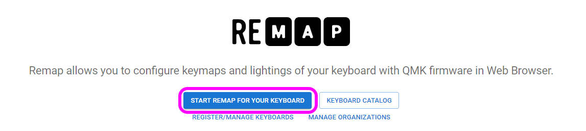

# On the 15 ビルドガイド
- [キット内容](#キット内容)
- [レイアウトを決める](#レイアウトを決める)
- [ソケットのはんだ付け](#ソケットのはんだ付け)
- [組み立て](#組み立て)
- [キーマップのカスタマイズ](#キーマップのカスタマイズ)
- [その他](#その他)

## キット内容
  
||部品名|数| |
|-|-|-|-|
|1|メインボード|1||
|2|トッププレート|1||
|3|ゲタ|2||
|3|ネジ|13|4mm|
|4|スペーサー|8|3mm|
|5|ナット|8||
|6|Cherry MX ホットスワップソケット|60||

### キット以外に必要なもの
|部品名|数|||
|-|-|-|-|
|キースイッチ||CherryMX互換|[遊舎工房](https://shop.yushakobo.jp/collections/all-switches/cherry-mx-%E4%BA%92%E6%8F%9B-%E3%82%B9%E3%82%A4%E3%83%83%E3%83%81) / [TALPKEYBOARD](https://talpkeyboard.net/?category_id=59cf8860ed05e668db003f5d) / [DailyCraftKeyboard](https://shop.dailycraft.jp/collections/mx-switches)|
|キーキャップ||CherryMX互換|[遊舎工房](https://shop.yushakobo.jp/collections/keycaps/cherry-mx-%E4%BA%92%E6%8F%9B-%E3%82%AD%E3%83%BC%E3%82%AD%E3%83%A3%E3%83%83%E3%83%97) / [TALPKEYBOARD](https://talpkeyboard.net/?category_id=59e2acfaed05e644fd004008)|
|Type-C ケーブル|1|||

### オプション
|部品名|数|||
|-|-|-|-|
|スタビライザー|必要数|2U、PCBマウント|[遊舎工房](https://shop.yushakobo.jp/collections/all-keyboard-parts/Stabilizer) / [TALPKEYBOARD](https://talpkeyboard.net/?category_id=5f884b9b3313d216eb50558a)|
|ロータリーエンコーダ|～4|EC11/EC12/ロープロファイル|[遊舎工房](https://shop.yushakobo.jp/search?q=%E3%83%AD%E3%83%BC%E3%82%BF%E3%83%AA%E3%83%BC%E3%82%A8%E3%83%B3%E3%82%B3%E3%83%BC%E3%83%80%E3%83%BC+%E3%83%8E%E3%83%96%E4%BB%98%E3%81%8D) / [TALPKEYBOARD](https://talpkeyboard.net/items/5f3f1a597df28129f2fd4b0f) / [DailyCraftKeyboard](https://shop.dailycraft.jp/products/encoder_low) / [Amazon](https://www.amazon.co.jp/s?k=EC11+%E3%82%A8%E3%83%B3%E3%82%B3%E3%83%BC%E3%83%80%E3%83%BC&language=ja_JP)|
|ノブ|～4|外径19mmまで|[DailyCraftKeyboard](https://shop.dailycraft.jp/products/encoder_lowprofile_knob) / [Amazon](https://www.amazon.co.jp/s?k=%E3%82%A8%E3%83%B3%E3%82%B3%E3%83%BC%E3%83%80%E3%83%BC+%E3%83%8E%E3%83%96)|

### 必要な工具
|工具名|
|-|
|はんだごて|
|こて先クリーナー（こて台）|
|鉛入りはんだ|
|ピンセット|
|精密ドライバー|
|ニッパー等ダイオードの足を切れるもの|

### あると便利な工具
|工具名|
|-|
|耐熱シリコンマット|
|温度調節可能なはんだごて|
|斜めに切ったタイプのこて先|
|フラックス|
|フラックスリムーバー、IPA|
|テスター|
|マスキングテープ|
|はんだ吸い取り線|
|はんだ吸い取り器|

## レイアウトを決める
On the 15は60キーの格子配列キーボードですが、色のついたところは交換が可能になっています。

ビルドガイドではこのような配列で組み立てます。　

RemapやKeyboard LAyout Editorで
## ソケットのはんだ付け

### （オプション）ロータリーエンコーダーのはんだ付け

## 組み立て
### （オプション）スタビライザーを組み立てる
スタビライザーがあると2Uのキーの押下が安定します。無くても使えるのでお好みでお使いください。
ねじ止め式のスタビライザーは縦に二つ並べておくことはできないので使う場所には気をつけるかスナップ型のスタビライザーを使ってください。
  
小さい方のパーツの穴が二つ開いている側を、大きいパーツの穴が開いている方向に合わせて組み合わせます。  
  
金属の棒を下の穴に差し込みツメにパチっと音がするまで押し込んで完成です。
    
基板の大きい方の穴にツメをひっかけながら取り付けます。  
  

### ゲタをケースに組み付け
ゲタにスペーサーを取り付けます。
Type-Cのコネクタが付いている方を左側にして、画像のように付けてください。

ケースにゲタをねじ止めします。

### トッププレートを取り付ける
メインボードとトッププレートの位置を合わせて、まずは4隅にキースイッチをはめ込みます。
スイッチのツメにプレートがひっかかるようにしましょう。

全てのスイッチを取り付けました。

### ケースに入れる
ゲタにメインボードをのせて、トッププレートの穴からねじ止めします。

キーキャップを付けたら完成です。

## キーマップのカスタマイズ
ChromeかEdgeでRemapにアクセスしてください。  
- Remap https://remap-keys.app/

  
左を選んで進んでいくとアドレスバーからメッセージが出てキーボードを選択できます。  

ドラッグアンドドロップでキーマップの変更が終わったら右上のflashボタンを押すと反映されます。  
  

## レイアウトオプション
キーの長さを作ったキーボードと合わせることができます。

## レイアウトの保存と復元
⇔アイコンで作ったレイアウトを保存することができます。  
いくつかサンプルをご用意しました。自分のレイアウトを公開することもできるので是非お試しください。
  

