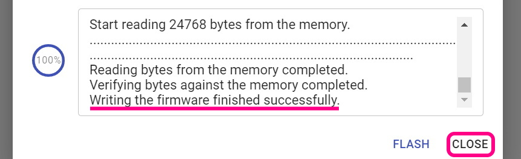

# On the 15 60%ケース対応版（[スタンドアローン版](https://github.com/Taro-Hayashi/On-the-15/blob/main/README_SA.md)）
- [キット内容](#キット内容)
- [レイアウトを決める](#レイアウトを決める)
- [ソケットのはんだ付け](#ソケットのはんだ付け)
- [組み立て](#組み立て)
- [キーマップのカスタマイズ](#キーマップのカスタマイズ)
- [そのほか](#そのほか)

## キット内容
  
||部品名|数| |
|-|-|-|-|
|1|メインボード|1||
|2|トッププレート|1||
|3|マウントプレート|2||
|4|ネジ|13|4mm|
|5|スペーサー|8|3mm|
|6|ワッシャー|8||
|7|ナット|8||
|8|リセットスイッチ|1||
|9|Cherry MX ホットスワップソケット|60||

### キット以外に必要なもの
|部品名|数|||
|-|-|-|-|
|キースイッチ|〜60|CherryMX互換|[遊舎工房](https://shop.yushakobo.jp/collections/all-switches/cherry-mx-%E4%BA%92%E6%8F%9B-%E3%82%B9%E3%82%A4%E3%83%83%E3%83%81) / [TALPKEYBOARD](https://talpkeyboard.net/?category_id=59cf8860ed05e668db003f5d) / [DailyCraftKeyboard](https://shop.dailycraft.jp/collections/mx-switches)|
|キーキャップ|〜60|CherryMX互換|[遊舎工房](https://shop.yushakobo.jp/collections/keycaps/cherry-mx-%E4%BA%92%E6%8F%9B-%E3%82%AD%E3%83%BC%E3%82%AD%E3%83%A3%E3%83%83%E3%83%97) / [TALPKEYBOARD](https://talpkeyboard.net/?category_id=59e2acfaed05e644fd004008)|
|60%ケース（DZ60, GH60, Poker互換）|1|[対応を確認したケース](case.md)|[遊舎工房](https://shop.yushakobo.jp/collections/case/60-%E3%82%B1%E3%83%BC%E3%82%B9) / [TALPKEYBOARD](https://talpkeyboard.net/?category_id=616b94a72b36826570485308)|
|Type-C ケーブル|1|||

### オプション
|部品名|数|||
|-|-|-|-|
|スタビライザー||2U、PCBマウント|[遊舎工房](https://shop.yushakobo.jp/collections/all-keyboard-parts/Stabilizer) / [TALPKEYBOARD](https://talpkeyboard.net/?category_id=5f884b9b3313d216eb50558a)|
|ロータリーエンコーダ|～4|EC11/EC12/ロープロファイル|[遊舎工房](https://shop.yushakobo.jp/search?q=%E3%83%AD%E3%83%BC%E3%82%BF%E3%83%AA%E3%83%BC%E3%82%A8%E3%83%B3%E3%82%B3%E3%83%BC%E3%83%80%E3%83%BC+%E3%83%8E%E3%83%96%E4%BB%98%E3%81%8D) / [TALPKEYBOARD](https://talpkeyboard.net/items/5f3f1a597df28129f2fd4b0f) / [DailyCraftKeyboard](https://shop.dailycraft.jp/products/encoder_low) / [Amazon](https://www.amazon.co.jp/s?k=EC11+%E3%82%A8%E3%83%B3%E3%82%B3%E3%83%BC%E3%83%80%E3%83%BC&language=ja_JP)|
|ノブ|～4|外径19mmまで|[DailyCraftKeyboard](https://shop.dailycraft.jp/products/encoder_lowprofile_knob) / [Amazon](https://www.amazon.co.jp/s?k=%E3%82%A8%E3%83%B3%E3%82%B3%E3%83%BC%E3%83%80%E3%83%BC+%E3%83%8E%E3%83%96)|

### 必要な工具
|工具名|
|-|
|はんだごて|
|こて先クリーナー（こて台）|
|鉛入りはんだ|
|ピンセット|
|精密ドライバー|

## レイアウトを決める
On the 15は60キーの格子配列キーボードですが、色のついたキーは長さを変更することできます。  
  
ビルドガイドではこのようなレイアウトで組み立てます。　
  
RemapやKeyboard Layout Editorでシミュレーションすることもできます。  
- Remap
- [Keyboard Layout Editor](http://www.keyboard-layout-editor.com/#/gists/feebeb1f95b04ed5593eb9c8289f1239)
## ソケットのはんだ付け
使うソケットのパッドに予備はんだをします。最下段はキーの長さに気を付けてください。  
  
 
 
あらかじめ薄くはんだを乗せます。  
  
ソケットを置いたらピンセットで押さえつけながらはんだを注いでいきます。入り組んでいて表面積が多いので多めに必要になります。 
  
慣れてきたら予備はんだを省略したり、一度に複数個置いてはんだ付けをすると楽になります。  
  

### （オプション）ロータリーエンコーダーのはんだ付け
足を折らないようにホールに通して裏からはんだ付けします。  
   

### 動作確認
キースイッチを差したり裏をピンセットで短絡したりして動作確認をしておくと安心です。  
   
   

## 組み立て
### （オプション）スタビライザーを組み立てる
スタビライザーがあると2Uのキーの押下が安定します。無くても使えるのでお好みでお使いください。  
ねじ止め式のスタビライザーは縦に二つ並べておくことはできないので使う場所に気をつけるかスナップ型のスタビライザーを使ってください。  
  
小さい方のパーツの穴が二つ開いている側を、大きいパーツの穴が開いている方向に合わせて組み合わせます。  
  
金属の棒を下の穴に差し込みツメにパチっと音がするまで押し込んで完成です。  
    
基板の大きい方の穴にツメをひっかけながら取り付けます。  
  

### メインボードをケースに設置する
マウントプレートにスペーサー、ワッシャー、ナットを取り付けます。  
Type-Cのコネクタが付いている方を左側にして、画像のように付けてください。  
   
ワッシャーはスペーサーの側に通します。  
   
ケースにマウントプレートをねじ止めします。  
   
メインボードをねじ止めします。  
   

### トッププレートを取り付ける
メインボードとトッププレートの位置を合わせて、まずは4隅にキースイッチをはめ込みます。  
   
メインプレートにはスイッチのツメにひっかかるように、メインボードに差す時はピンが曲がらないように気を付けます。  
   
キーキャップを付けたら完成です。
 
LEDをオフにしたい場合は左上(ESC)のキーを押しながらその下のキーを押してください。

## キーマップのカスタマイズ
デフォルトではビルドガイドに合わせたキーマップになっています。

ChromeかEdgeでRemapにアクセスしてください。  
- Remap https://remap-keys.app/

  
左を選んで進んでいくとアドレスバーからメッセージが出てキーボードを選択できます。  

ドラッグアンドドロップでキーマップの変更が終わったら右上のflashボタンを押すと反映されます。  
  

### レイアウトオプション
キーの長さを作ったキーボードと合わせることができます。
  
### レイアウトの保存と復元
⇔アイコンで作ったレイアウトを保存することができます。  
  
いくつかサンプルをご用意しました。自分のレイアウトを公開することもできます。

## そのほか
### リセットスイッチの押し方
こちらの隙間からドライバーやピンセットを差し込むことで押すことができます。
  

### ファームウェアのアップデート
不具合なく動いている場合は必要ありません。問題があった場合はお試しいただくと解決することがあります。  
Remapのファームウェアのページにアクセスしてください。  
- Remap

Remap用で一番数字が大きいファームウェアをFLASHします。テストをしたい場合はテスト版を選んでください。  
 
キットのリセットスイッチを押すとArduino Microが現れるので、クリックして接続します。  
 
書き込みが完了したらウィンドウを閉じて大丈夫です。  
 

### ファームウェアのコード
https://github.com/Taro-Hayashi/qmk_firmware/tree/master/keyboards/tarohayashi/onthe15

### VIA用JSON
- [onthe15.json](https://github.com/Taro-Hayashi/On-the-15/releases/download/15.23/onthe15.json)

### プレートのデータ
- [onthe15_plates.zip](https://github.com/Taro-Hayashi/On-the-15/releases/download/15.23/onthe15_plates.zip)

### 販売ページ
- BOOTH: https://tarohayashi.booth.pm/items/3657566
