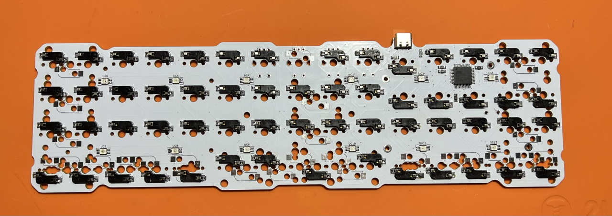
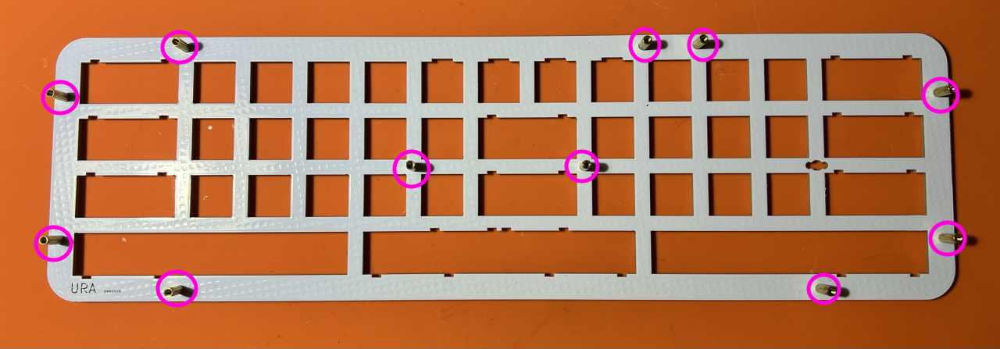
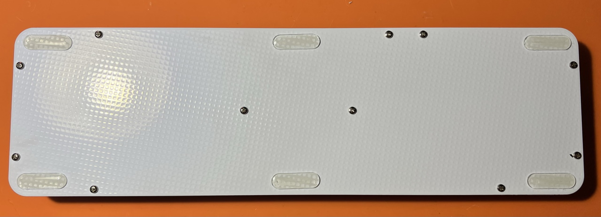

# On the 15 Build Manual ([日本語](README.md))
- [Contens](#Contens)
- [Preparation](#Preparation)
- [Soldering](#Soldering)
- [Assembling](#Assembling)
- [Customise](#Customise)

## Contents
  
  
||Name|Quantities|
|-|-|-|
|1|Main board|1|
|2|Top plate|1|
|3|Bottom plate|1|
|4|Screws|22|
|5|Spacers|11|
|6|Tactile Switch|1|
|7|Hotswap sockets|60|
|8|Rubber feet|6|
|9|Middle paltes||
|10|Stabilizer|1|
|11|Rotary encoder|1|
|12|Knob|1|

### Additional required
|Name|Quantities||
|-|-|-|
|Keyswitches|up to 60|CherryMX|
|Keycaps|up to 60|CherryMX|
|Type-C Cable|1||

### Optional
|Name||
|-|-|
|Stabilizer|2U, PCB mounted|
|Rotary encoders|EC11/EC12|
|Knobs|Outer diameter up to 19mm|

## Preparation
This kit has a variety of layouts to choose from.
    
- [Remap - On the 15 - KEYMAP](https://remap-keys.app/catalog/9bQPDxdkX8xgflHlsR9p/keymap)
- [Keyboard Layout Editor](http://www.keyboard-layout-editor.com/#/gists/feebeb1f95b04ed5593eb9c8289f1239)

In this manual, we use rotary encoder and 2 2U keys.
  

## Soldering
### Hotswap sockets
使うソケットのパッドに予備はんだをします。  
あらかじめ薄くはんだを乗せます。  
  
ソケットを置いたらピンセットで押さえつけながらはんだを注いでいきます。入り組んでいて表面積が多いので多めに必要になります。
  
最下段のキーはシルク印刷を参考にしてソケットを取り付けてください。
  
慣れてきたら予備はんだを省略したり、一度に複数個置いてはんだ付けをすると楽になります。  
  
### Tactile switch
表面左側のRESETと書いてあるところにリセットスイッチを差して裏からはんだ付けします。  
  

### Rotary encoder
足を折らないようにホールに通して裏からはんだ付けします。  
   

### Testing
キースイッチを差したり裏をピンセットで短絡したりして動作確認をしておくと安心です。  
   
   

## Assembling
### Stabilizers
スタビライザーがあると2Uのキーの押下が安定します。無くても使えるのでお好みでお使いください。  
ねじ止め式のスタビライザーは縦に二つ並べておくことはできないので使う場所に気をつけるかスナップ型のスタビライザーを使ってください。  

小さい方のパーツの穴が二つ開いている側を、大きいパーツの穴が開いている方向に合わせて組み合わせます。  
  
金属の棒を下の穴に差し込みツメにパチっと音がするまで押し込んで完成です。  
    
基板の大きい方の穴にツメをひっかけながら取り付けます。  
  

### Plates
トッププレートの裏側にスペーサーをねじ止めします。  
   
メインボードにかぶせて、4隅のスイッチをはめ込みます。  
   
すべてのスイッチを差し込みました。  
  
画像のような形で3段にして挟み込みます。  
  
赤丸の部分の1段目は一度スペーサーを外してスライドさせた方が楽かもしれません。 
  
バックプレートをねじ止めしてゴム足を貼ります。  
  
キーキャップを付けたら完成です。  
  
LEDをオフにしたい場合は左上(ESC)のキーを押しながらその下のキーを押してください。   
光り方を変えたい場合は左上(ESC)のキーを押しながらその隣のキーを押してください。  

## Customise
デフォルトではビルドガイドに合わせたキーマップになっています。

ChromeかEdgeでRemapにアクセスしてください。  
- Remap https://remap-keys.app/

  
左を選んで進んでいくとアドレスバーからメッセージが出てキーボードを選択できます。  

ドラッグアンドドロップでキーマップの変更が終わったら右上のflashボタンを押すと反映されます。  
  

### レイアウトオプション
キーの長さを作ったキーボードと合わせることができます。
  
### レイアウトの保存と復元
⇔アイコンで作ったレイアウトを保存することができます。  
  
いくつかサンプルをご用意しました。自分のレイアウトを公開することもできますのでお気軽に共有してください。

### Repository
https://github.com/Taro-Hayashi/qmk_firmware/tree/master/keyboards/tarohayashi/onthe15

### JSON
- [onthe15.json](https://github.com/Taro-Hayashi/On-the-15/releases/download/15.23/onthe15.json)

### Plates data
- [onthe15_plates.zip](https://github.com/Taro-Hayashi/On-the-15/releases/download/15.23/onthe15_plates.zip)

- On the 15（BOOTH）: https://tarohayashi.booth.pm/items/3672079
