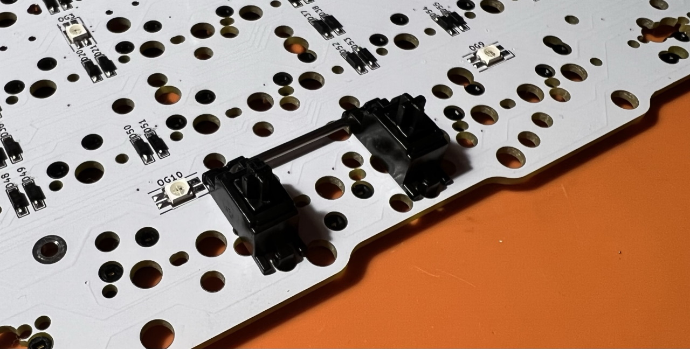
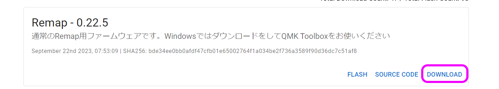
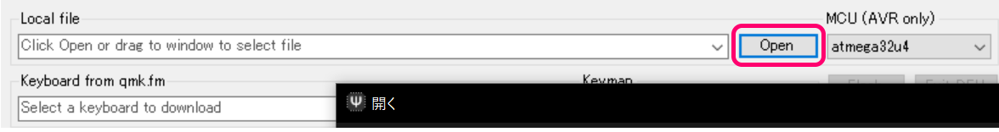
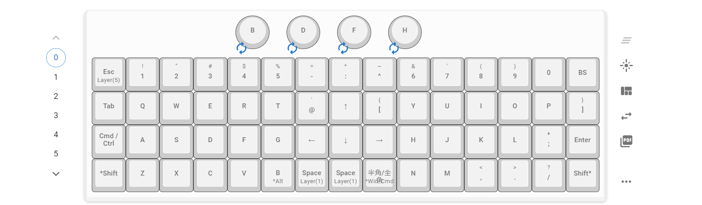

# On the 15 Build Manual ([日本語](README.md))
- [Contents](#Contens)
- [Preparation](#Preparation)
- [Soldering](#Soldering)
- [Assembling](#Assembling)
- [Customise](#Customise)

## Contents
  
  
||Name|Quantities|
|-|-|-|
|1|Main board|1|
|2|Top plate|1|
|3|Bottom plate|1|
|4|Screws|22|
|5|Spacers|11|
|6|Tactile Switch|1|
|7|Hotswap sockets|60|
|8|Rubber feet|6|
|9|Middle paltes||
|10|Stabilizer|1|
|11|Rotary encoder|1|
|12|Knob|1|

### Additional required
|Name|Quantities||
|-|-|-|
|Keyswitches|up to 60|CherryMX|
|Keycaps|up to 60|CherryMX|
|Type-C Cable|1||

### Optional
|Name||
|-|-|
|Stabilizer|2U, PCB mounted|
|Rotary encoders|EC11/EC12|
|Knobs|Outer diameter up to 19mm|

## Preparation
This kit has a variety of layouts to choose from.
    
In this manual, we use rotary encoder and 2 2U keys.
  

## Soldering
### Hotswap sockets
Apply a thin layer of solder beforehand.
  
Solder sockets
  
For 1.25U and 1.5U, refer to silk printing.
   
  
### Tactile switch 
  

### Rotary encoder
   

### Testing 
   
   

## Assembling
### Stabilizers  
   
    
  

### Plates
Screw the spacer to the back of the top plate.    
   
Put it over the main board and install the switch.  
     
  
Attach acrylic plates in three tiers.   
  
  
Screw the back plate and affix the rubber feet.  
  
Install the Keycaps.  
  
Thank you for your time.

### テストファームウェアの書き込み
Download firmware.
- https://remap-keys.app/catalog/9bQPDxdkX8xgflHlsR9p/firmware

 

Install QMK Toolbox.
- [Releases・qmk/qmk_toolbox](https://github.com/qmk/qmk_toolbox/releases)

  
   
  
   

## Customise
Access Remap.  
- Remap https://remap-keys.app/

Select the blue button on the left to proceed.  
  

  

After Drag-and-Drop the keys, press the flash button in the upper right corner.  

 

### Repository
https://github.com/Taro-Hayashi/qmk_firmware/tree/master/keyboards/tarohayashi/onthe15

### Plates data
- [onthe15_plates.zip](https://github.com/Taro-Hayashi/On-the-15/releases/latest/download/15.23/onthe15_plates.zip)

- On the 15（BOOTH）: https://tarohayashi.booth.pm/items/3672079
